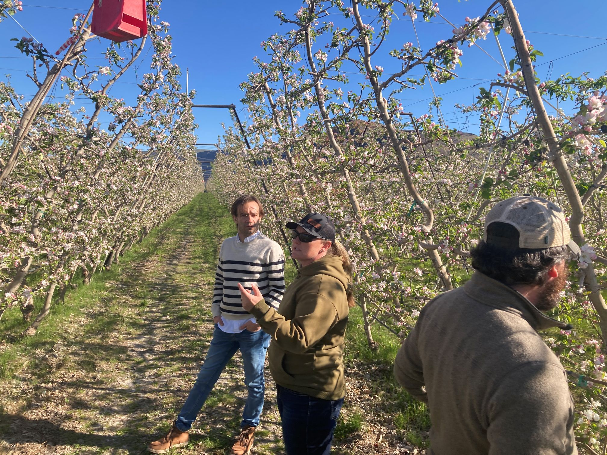

Along with my colleagues Diego Rincon and Dave Crowder, we have just published "Sequential testing of complementary hypotheses about population density" in MEE. The idea started as an offshoot of our research into improving site-specific predictions of Codling moth, a prolific tree fruit pest. Conventional planning for pest management typically involves a phenology model, which relates heat accumulation to pest emergence after the winter, in combination with on-site sampling to inform decisions about controlling pest populations. A drawback of existing methods is that phenology and sampling remain unlinked; growers use their intuition and experiences to connect the dots. The intuition of experienced growers is not to be underestimated, and they are skilled at knowing how pest counts by certain periods in the season are related to seasons where management interventions are needed. We wanted growers to be able to set their own maximum tolerable thresholds, and for us to use our site-specific profiles in conjunction with early-season data to predict the probability of exceeding those thresholds.

 

After surveying the state-of-the-art in sequential analysis, we found limitations in existing methods. The most popular sequential data analysis procedure is the Sequential Probability Ratio Test (SPRT), introduced in 1945 by Abraham Wald, but it requires fixed sample sizes and the specification of two non-complementary models (i.e. tests if average captures per sample are 8 vs 10, rather than them being greater than or less than 9). Furthermore, the original methodology only accounts for one-at-a-time sequential sampling and requires complicated modifications to support group sequential designs that are inherent to pest sampling networks. We believed that the problem of iteratively updating our knowledge and predictions based on new data aligns with the philosophy of Bayesian statistics, and sure enough we found methods utilizing Bayes' Rule to the domain of sequential hypothesis testing in Morgan & Cressie's Variable Probability Ratio Test (VPRT). Their method, while providing compelling optimality properties, still requires non-complementary hypothesis ratios and comes with the computational difficulties of Bayesian methods. Our new method, the Sequential Test of Bayesian Posterior Probabilities (STBP) can be seen as building on the VPRT and aims to provide an ergonomic and intuitive procedure that explicitly supports variable sample sizes over time, explicit threshold-style hypotheses, and even dynamic trajectories as hypotheses.

It works by making a crucial simplification of typical Bayesian methods: instead of the specification of proper prior probability distributions, it assigns a single probability to the parameter of inference being greater (or less) than the threshold and the complementary probability for it being less (or greater) than that threshold. This is in comparison to the typical procedure of giving each possible value of the parameter its own probability density. This reduces the resulting posterior probability from an entire distribution to a single number, which we can then plug back into the equation as the prior probability for the next iteration. It also eliminates the difficult computational exercise of integrating over constantly changing joint probability density functions which forms the major limitation for typical Bayesian methods. Integrals only need be calculated over your desired likelihood function, for which all commonly used distributions already have closed-form solutions in the form of their cumulative density functions! While our method had a greater rate of false positives compared to the SPRT in one-at-a-time sequential designs, it outperformed it when sequential sampling bouts are made of multiple samples. In general, the STBP requires less sampling and errors scaled more favorably with increasing sample sizes at each sampling time than the SPRT. We also tested our method as a procedure for invasive species monitoring, where it demonstrated higher power for equal sample sizes than conventional approaches, with further reductions in required sampling when prior belief in the absence of the invasive species is already high. We also found that our simplified model quickly converges on the results produced by more complex Bayesian techniques requiring proper conjugate priors just by increasing sample size.

.*](Fig2Post.jpeg)

 

Because our method allows for both variable sample sizes and sequential comparisons for changing-but-related hypotheses, it also has potential applications in continuous monitoring for signal processing, fraud detection, forensics, and clinical tests (like that of changes in glucose levels, heart rate, or mortality). For example, by continuously comparing the expected patient mortality rates for certain surgical procedures to that of individual surgeons, we found that [Harold Shipman's serial killings](https://en.wikipedia.org/wiki/Harold_Shipman) could have been detected with great confidence as early as in early 80s for female victims and early 90s for male victims. Unfortunately, the infamous "Dr. Death" was convicted as late as in January 2000 when he had killed nearly 300 people.

![*(A) Cumulative excess mortality, from the difference between death certificates signed by Harold Shipman and expected mortality in Wales, between 1977 and 1998 for male (blue) and female (red) patients aged 65 or older. (B) Sequential Test of Bayesian Posterior Probabilities for the hypothesis H1 that death certificates signed by Shipman exceed by 33% or more the expected mortality rates in Wales for males or females aged 65 or older. Horizontal dashed lines denote probabilities of 0.95 and 0.99. So, by 1980 for females and 1990 for males, there was > 95% chance "Dr. Death" had signed at least 33% more death certificates for patients aged 65 or older than the average of practitioners in Wales. Data was extracted from [Baker & Donaldson (2001)](https://www.researchgate.net/publication/320035425_Harold_Shipmans_clinical_practice_1974-1998_A_clinical_audit_commissioned_by_the_Chief_Medical_Officer) and the R code for this analysis is [here](https://github.com/rincondf/STBP/blob/main/ShipmanAnalysis.R).*](Fig3Post.jpeg)

 

Our method represents innovation in a section of the ecological and agricultural literature which has remained largely stagnant for many decades. The SPRT, introduced in 1945, is still the most widely used method for sequential analysis, and the fixed-sample size method used in invasive species monitoring has been used unchanged since its introduction in 1993. We plan on working to integrate the STBP into integrated pest management strategies in the Pacific Northwest, and hope to see others find places in their corners of science and industry where it can improve their processes and research. To facilitate this, we are working on an R package that will be easy to use and extensible. The source code can be found in this [GitHub repository](https://github.com/rincondf/STBP), and we will be working to release an R package to the CRAN repository in the coming weeks.